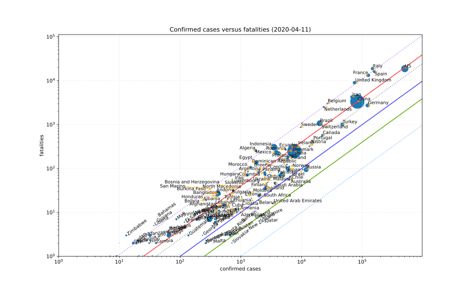
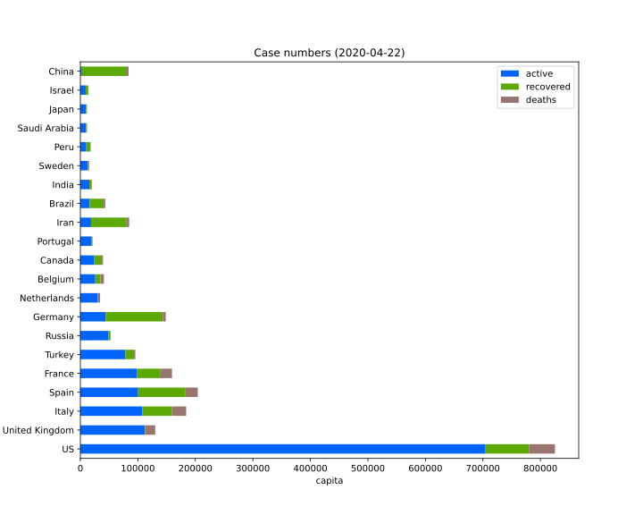
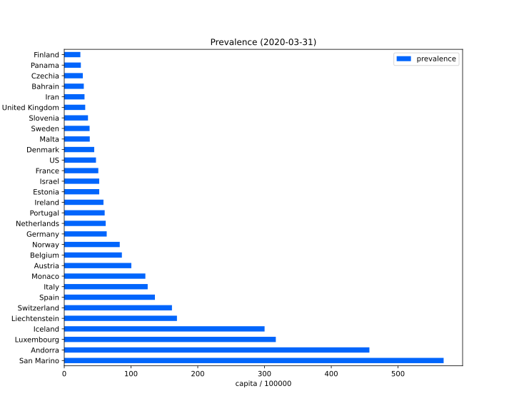
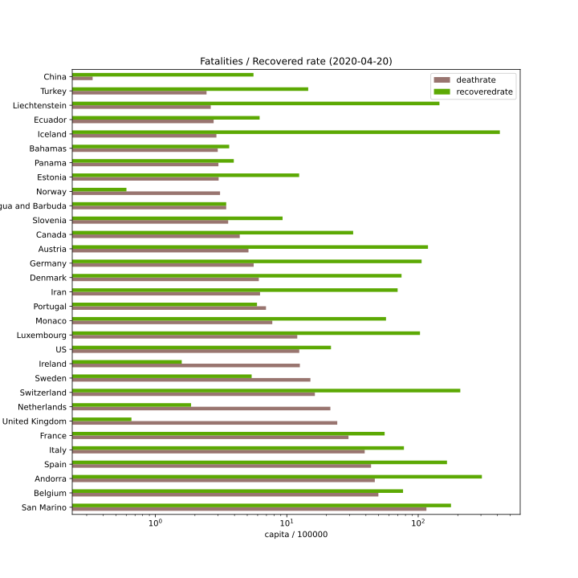

## COVID-19 data[^1]

### Confirmed cases versus fatalities

Death rate iso lines:

color        | rate   | notes
------------ | ------ | ------
*light blue* |  0.1%  | Influenza A
green        |  0.4%  |
blue         |  1%    |
*grey*       |  2.25% | Spanish Flue (1918)
red          |  4%    |
*purple*     |  11%   | SARS

### Account of active cases, recovered persons and fatalities

### Prevalence rate

### Fatalities / recovered rate

Portions copyright © XA, III-IV 2020. All rights reserved.

[^1]: Data sources, licensesn and attribution as well as copyright notes can be found on the [front page][main].

[main]: ./ "Data sources, licenses and attribution, copyright notes"
