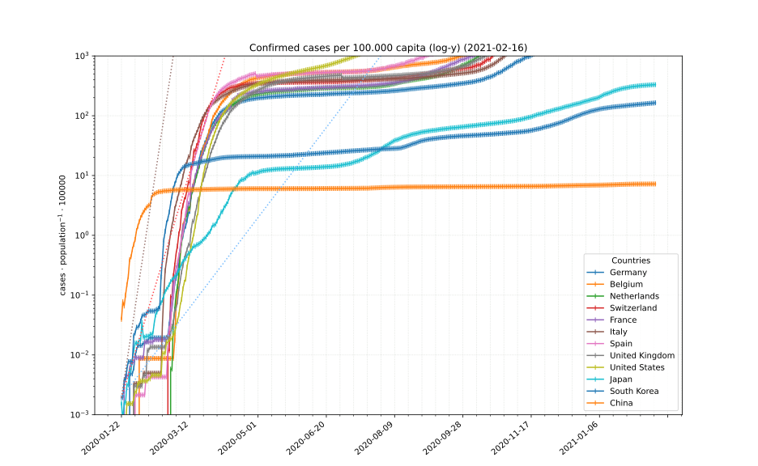
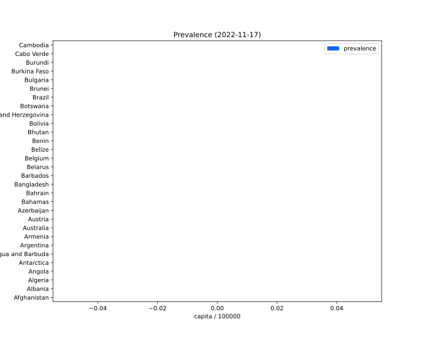

## COVID-19 data[^1]

### Confirmed cases relative to population

Growth rates (calibrated with South Korea):
color        | double every *n* days   |
------------ | ----------------------: |
light blue   |  10
red          |  4
grey         |  2

### Confirmed cases versus fatalities

Death rate iso lines:
color        | rate   | notes
------------ | ------ | ------
*light blue* |  0.1%  | Influenza A
green        |  0.4%  |
blue         |  1%    |
*grey*       |  2.25% | Spanish Flue (1918)
red          |  4%    |
*purple*     |  11%   | SARS

### Account of active cases, recovered persons and fatalities

### Prevalence rate

### Fatalities / recovered rate

[^1]: Data sources:
      - [2019 Novel Coronavirus COVID-19 (2019-nCoV) Data Repository by *Johns Hopkins CSSE*][JHUCSSE]
      - [CovidData], preprocessed *[JHU CSSE][JHUCSSE]* and [*New York Times*][NYTData] data
      - [Country information][CountryData1] by *lorey*, preprocessed [GeoNames] data

[JHUCSSE]: https://github.com/CSSEGISandData/COVID-19 "2019 Novel Coronavirus COVID-19 (2019-nCoV) Data Repository by Johns Hopkins CSSE"
[CovidData]: https://github.com/CSSEGISandData/covid-api "CovidData, preprocessed JHU CSSE and New York Times data"
[NYTData]: https://github.com/nytimes/covid-19-data "New York Times Covid-19 US states data"
[CountryData1]: https://github.com/CSSEGISandData/covid-api "GeoNames country data preprocessed by \"lorey\""
[GeoNames]: http://www.geonames.org/ "GeoNames"
