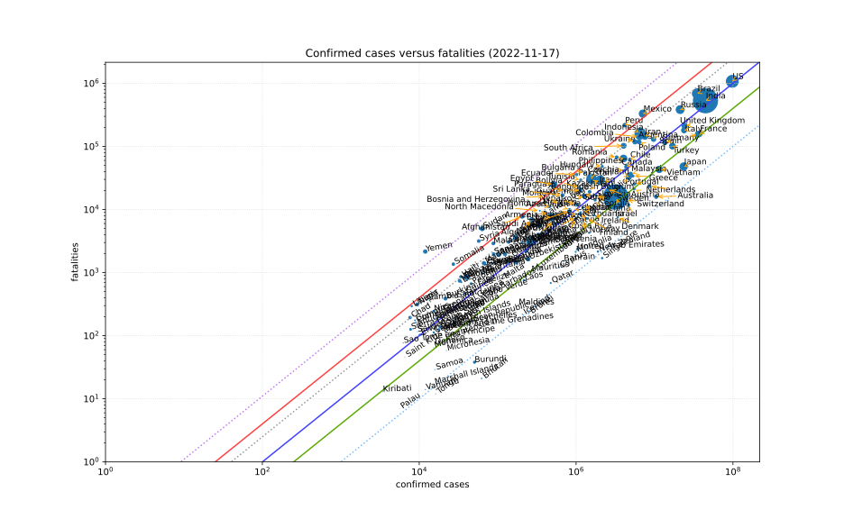
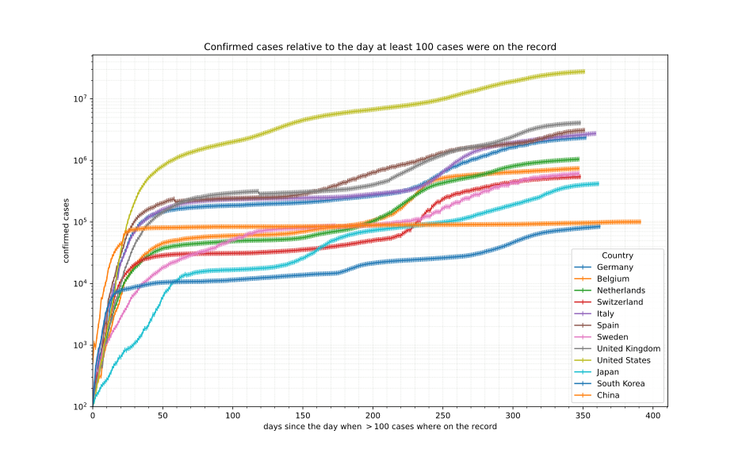

## COVID-19 data[^1]

### • [Confirmed cases relative to population][tl-cases-pcap-rel]

### • [Timeline of growth in cases and fatalities][tl-cases-rates]

### • [Account of active cases, recovered persons and fatalities][cases-pcap-absrel]

---

Death rate iso lines:

color        | rate   | notes
------------ | ------ | ------
*light blue* |  0.1%  | Influenza A
green        |  0.4%  |
blue         |  1%    |
*grey*       |  2.25% | Spanish Flue (1918)
red          |  4%    |
*purple*     |  11%   | SARS

Portions copyright © XA, III-IV 2020. All rights reserved.

---

[cases-pcap-absrel]: ./cases-pcap-absrel.md
[tl-cases-rates]: ./tl-cases-rates.md
[tl-cases-pcap-rel]: ./tl-cases-pcap-rel.md

[^1]: Data sources:
      - [2019 Novel Coronavirus COVID-19 (2019-nCoV) Data Repository by *Johns Hopkins CSSE*][JHUCSSE][^3]
      - [CovidData], preprocessed *[JHU CSSE][JHUCSSE]* and [*New York Times*][NYTData][^4] data
      - [Country information][CountryDataGN][^2] by [GeoNames]

[^2]: Licensed under a [Creative Commons Attribution 4.0 License][CC-by-4.0]
[^3]: [Terms of Use][JHU-TOS]: Data, copyright 2020 Johns Hopkins University, all rights reserved, is provided to the public strictly for educational and academic research purposes.
[^4]: [License and Attribution][NYT-TOS]: Data from *The New York Times*, based on reports from state and local health agencies.

[JHUCSSE]: https://github.com/CSSEGISandData/COVID-19 "2019 Novel Coronavirus COVID-19 (2019-nCoV) Data Repository by Johns Hopkins CSSE"
[CovidData]: https://github.com/coviddata/coviddata "CovidData, preprocessed JHU CSSE and New York Times data"
[NYTData]: https://github.com/nytimes/covid-19-data "New York Times Covid-19 US states data"

[GeoNames]: http://www.geonames.org/ "GeoNames"
[CountryDataGN]: https://download.geonames.org/export/dump/countryInfo.txt "GeoNames country data"

[CC-by-4.0]: https://creativecommons.org/licenses/by/4.0/ "Creative Commons Attribution 4.0 License"
[JHU-TOS]: https://github.com/CSSEGISandData/COVID-19/blob/master/README.md "Terms of use"
[NYT-TOS]: https://github.com/nytimes/covid-19-data#license-and-attribution "License and Attribution"
