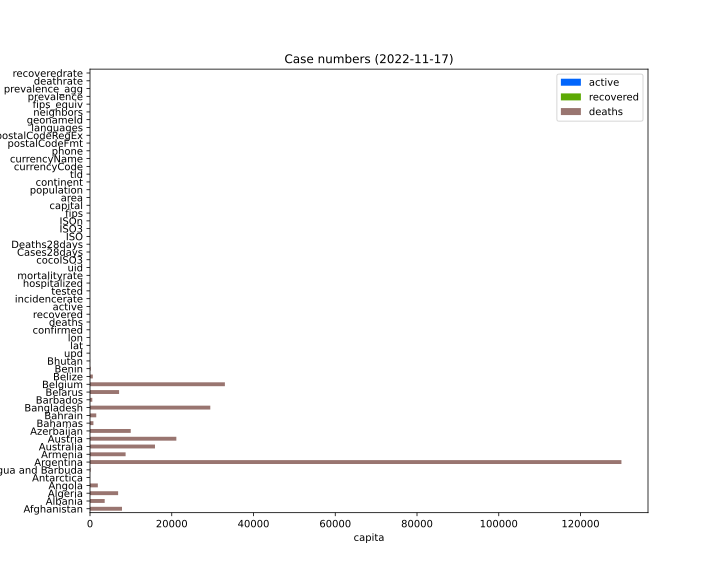
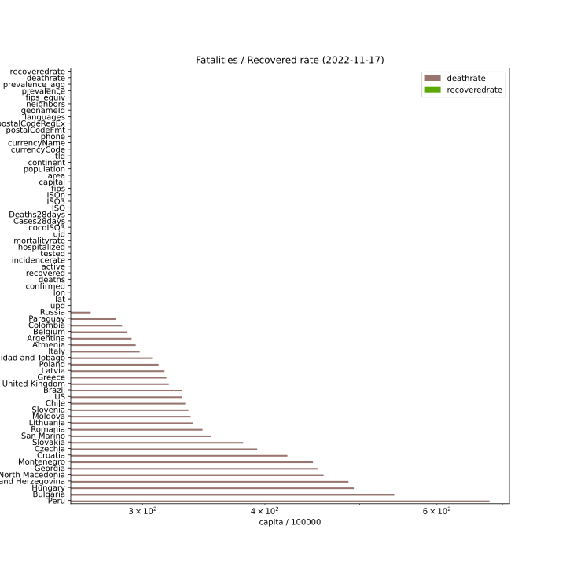

## COVID-19 data

### Confirmed cases relative to population

### Confirmed cases versus fatalities

Death rate iso lines
- 0.1% light blue (Influenza A)
- 0.4% green
- 1% blue
- 2.25% grey (Spanish Flue, 1918)
- 4.0% red
- 11% purple (SARS)

### Account of active cases, recovered persons and fatalities

### Prevalence rate

### Fatalities / recovered rate

