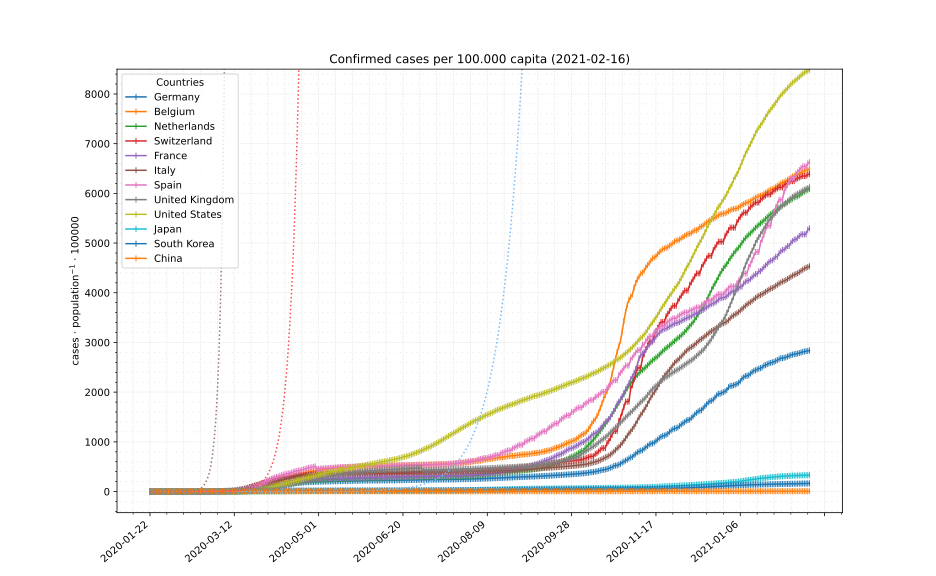
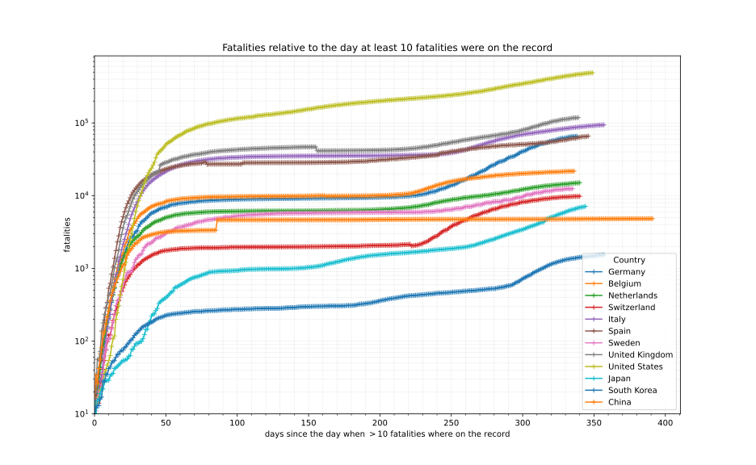

## COVID-19 data[^1]
[*←back*][main]

### Timeline of confirmed cases relative to population

Growth rates (calibrated with South Korea):

color        | double every *n* days
------------ | ----------------------:
light blue   |  10
red          |  4
grey         |  2

### Timeline of confirmed cases relative to the day when *n* cases were on the record

### Timeline of fatalities relative to the day when *n* fatalities were on the record

Portions copyright © XA, III-IV 2020. All rights reserved.

[^1]: Data sources, licenses and attribution as well as copyright notes can be found on the [front page][main].

[main]: ./ "Data sources, licenses and attribution, copyright notes"
