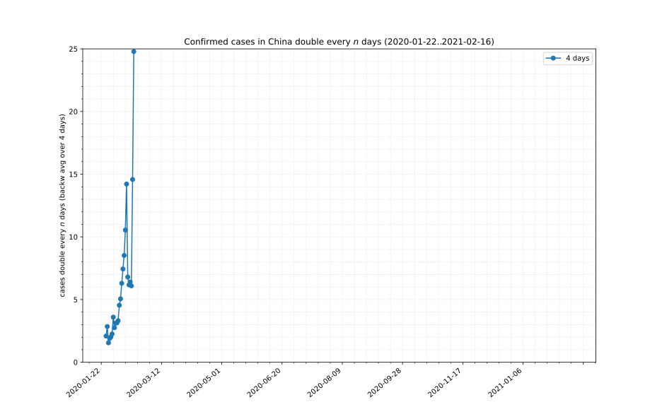
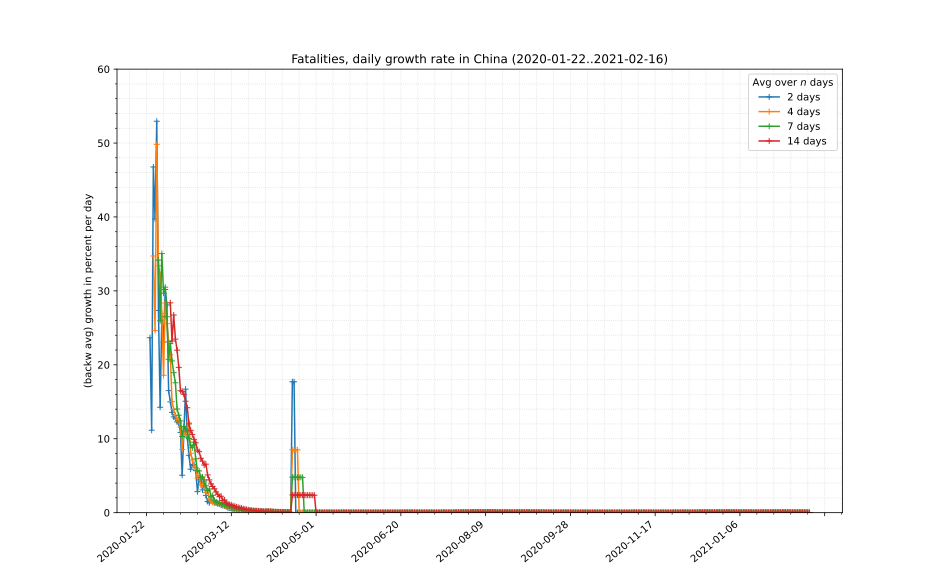

## COVID-19 data[^1]
[*←back*](tl-cases-rates.md)

### Timeline of growth

Portions copyright © XA, III-IV 2020. All rights reserved.

[^1]: Data sources, licenses and attribution as well as copyright notes can be found on the [front page][main].

[main]: ./ "Data sources, licenses and attribution, copyright notes"
