## COVID-19 data[^1]
[*←back*][main]

### Timeline of growth

- [Germany](tl-cases-rates-Germany.md)
- [Belgium](tl-cases-rates-Belgium.md)
- [Switzerland](tl-cases-rates-Switzerland.md)
- [Italy](tl-cases-rates-Italy.md)
- [Spain](tl-cases-rates-Spain.md)
- [Sweden](tl-cases-rates-Sweden.md)
- [China](tl-cases-rates-China.md)
- [United States](tl-cases-rates-United_States.md)

 Germany  | &nbsp;
:----------|------------
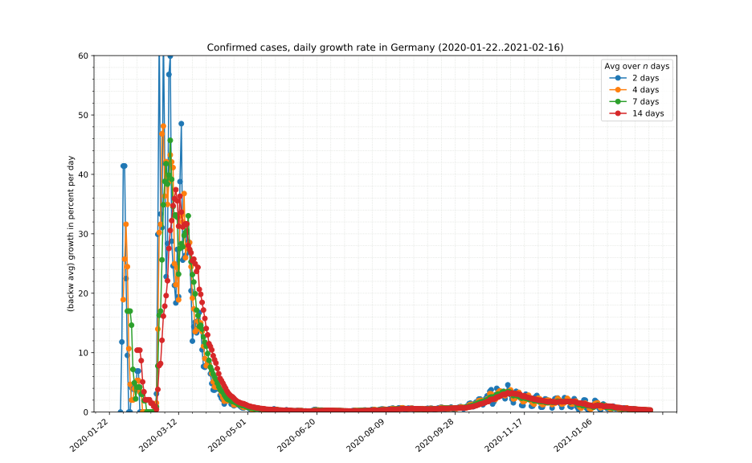 | 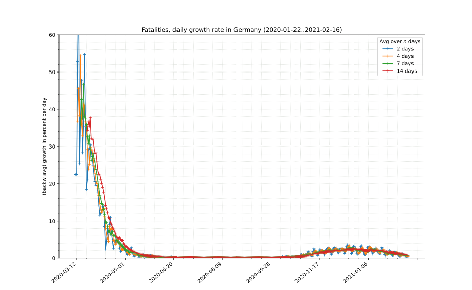

 Belgium  | &nbsp;
:----------|------------
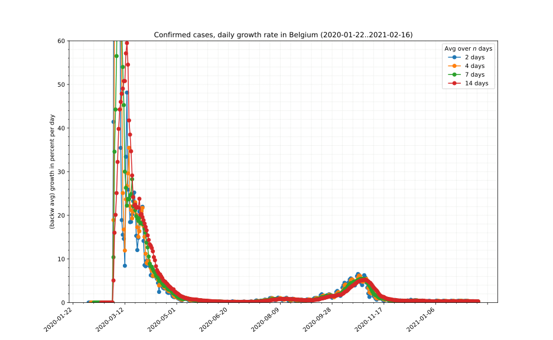 | 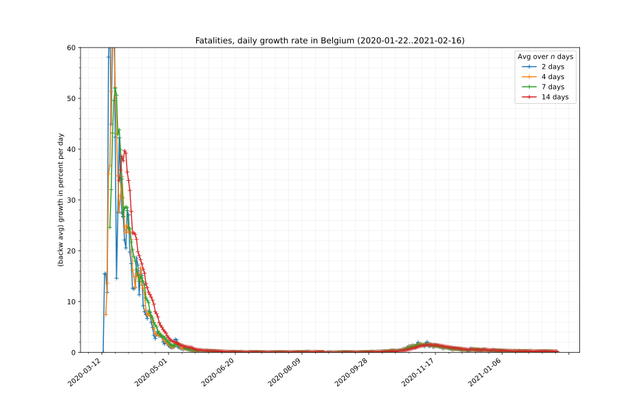

 Switzerland | &nbsp;
:----------|------------
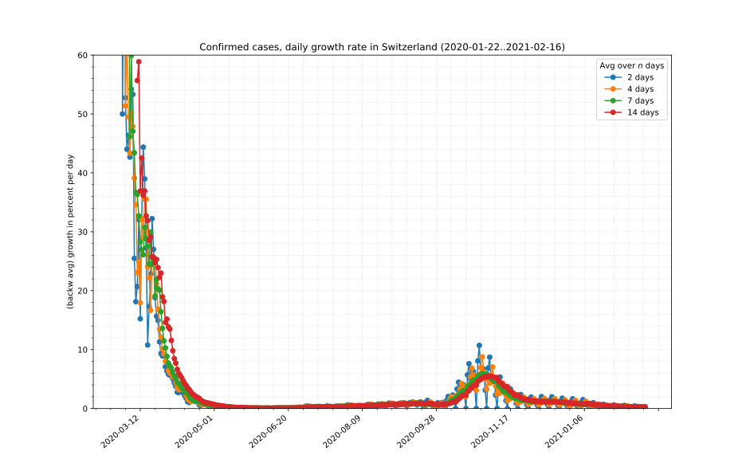 | 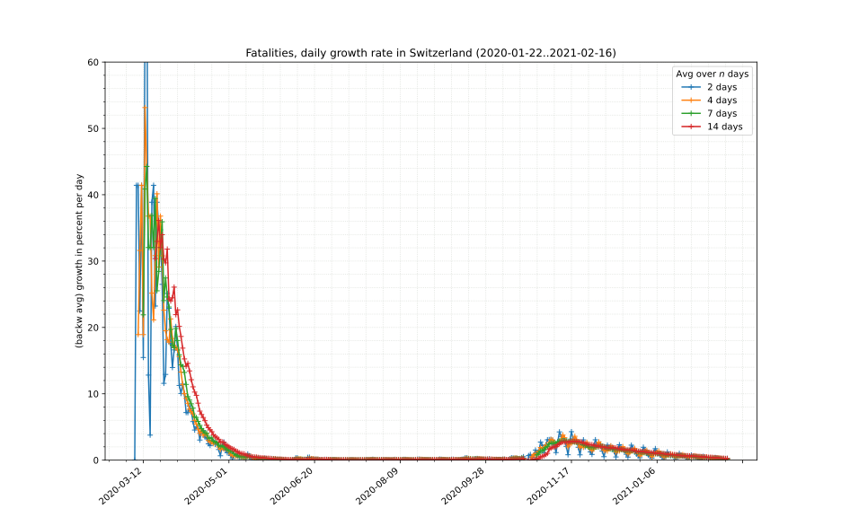

 Italy  | &nbsp;
:----------|------------
 | 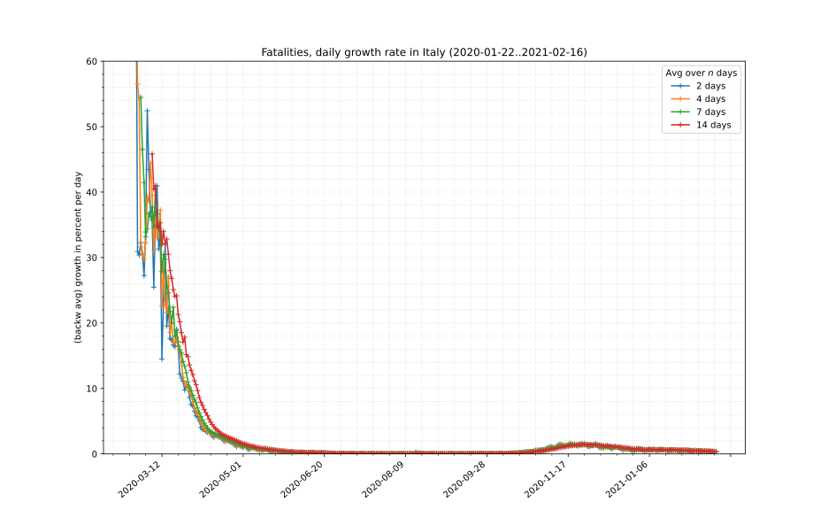

 Spain  | &nbsp;
:----------|------------
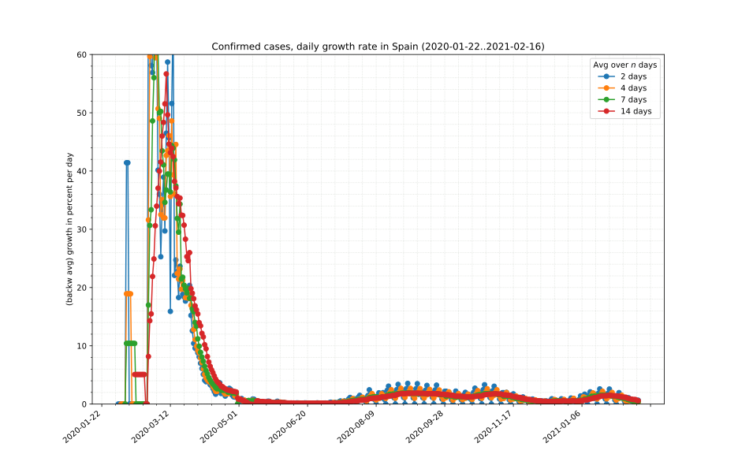 | 

 Sweden  | &nbsp;
:----------|------------
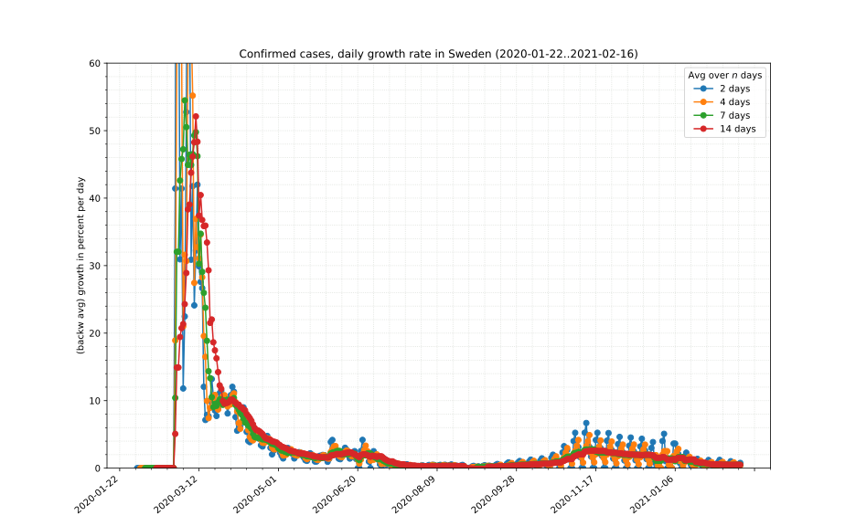 | 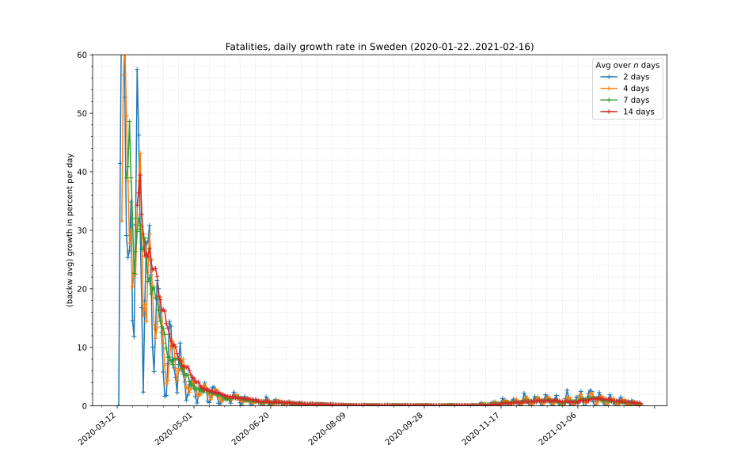

 China  | &nbsp;
:----------|------------
 | 

 United States  | &nbsp;
:----------|------------
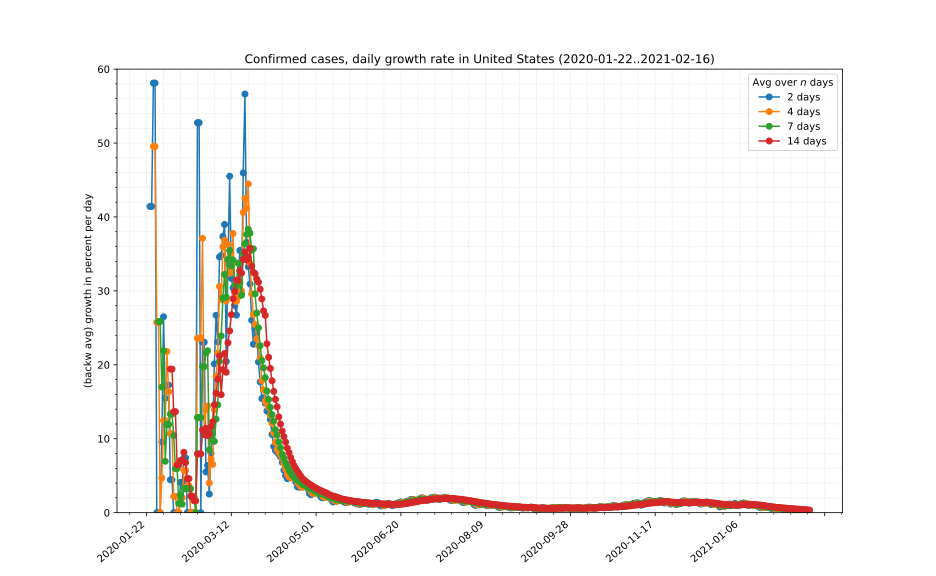 | 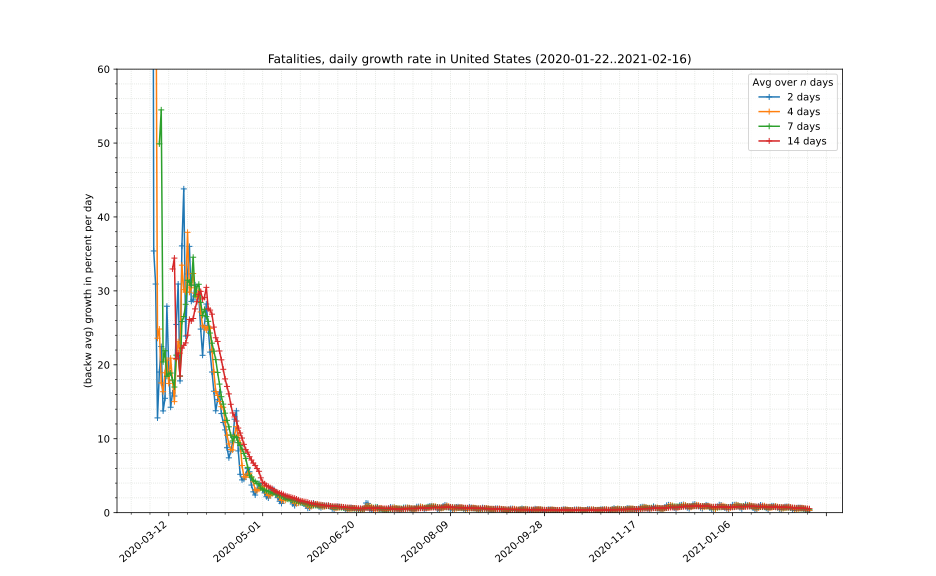

Portions copyright © XA, III-IV 2020. All rights reserved.

[^1]: Data sources, licenses and attribution as well as copyright notes can be found on the [front page][main].

[main]: ./ "Data sources, licenses and attribution, copyright notes"
